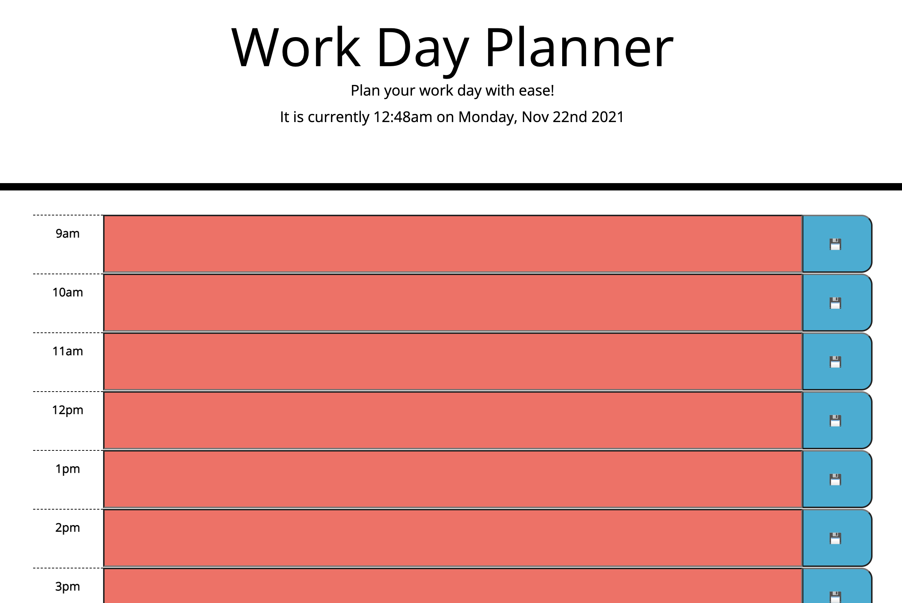
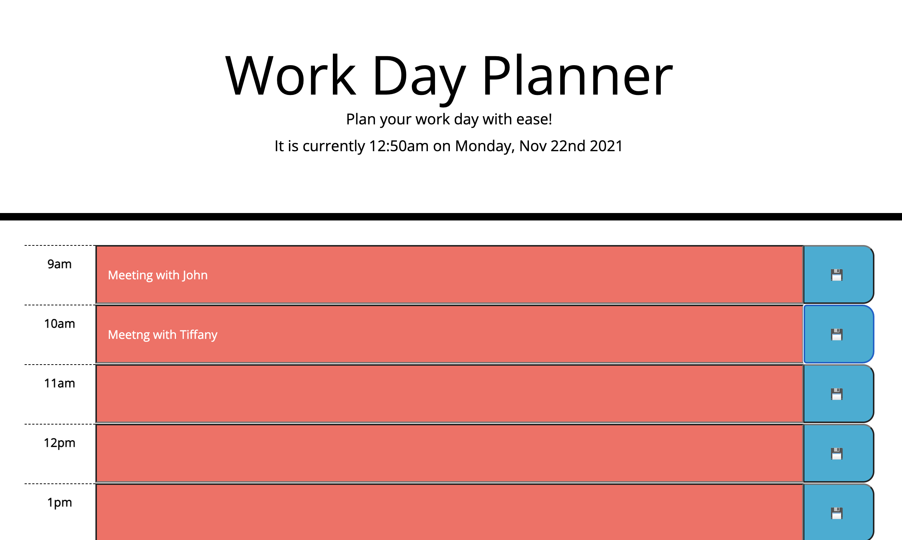

# Work Day Planner 

## Description
This app was designed to help you plan your day.

## Table of Contents
  - [Description](#description)
  - [Table of Contents](#table-of-contents)
  - [Installation](#installation)
  - [Usage](#usage)
  - [Contributing](#contributing)
  - [License](#license)
  - [Questions](#questions)

## Installation
Just visit the deployed site [here!](https://dimitermusic.github.io/work-day-planner.html/)

## Usage
Time field will be red if past, green if future, and grey if current:
  
You are able to store your input by submiting with the save button!

## Contributing
You are welcome to contribute as you wish! Also, feedback is always welcome!

## License
This application is covered under the MIT License

## Questions
If you have any questions, please visit my Github profile or email me using the links below

[Deployed Site](https://dimitermusic.github.io/work-day-planner.html/)  
[Repository](https://github.com/dimitermusic/work-day-planner.html)

## Questions
If you have any questions, please visit my Github profile or email me using the links below

[Github](https://github.com/dimitermusic)  
[Email](mailto:dimitermusic@gmail.com)  

